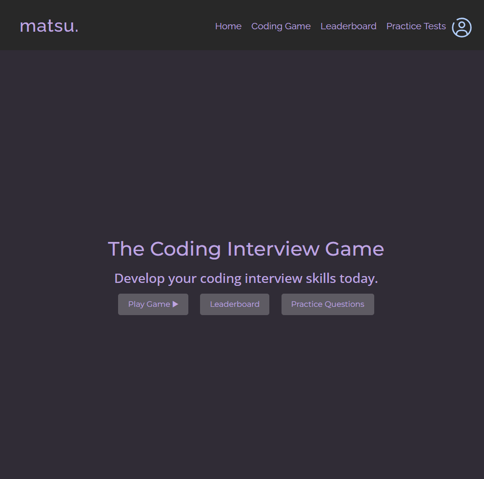
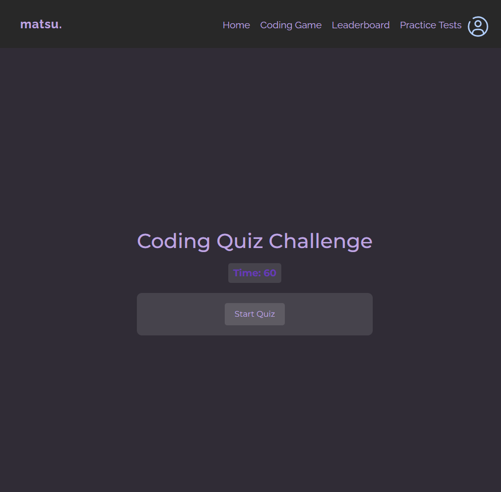
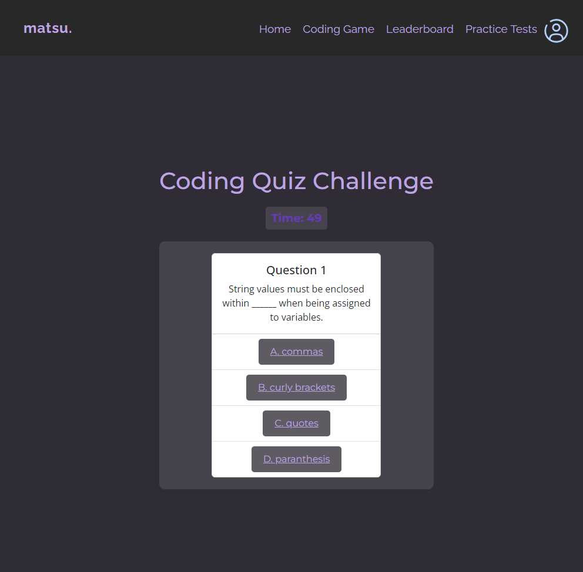

# Coding Interview Game
   


## Overview

The Coding Interview Game is a website designed to help users practice coding interview questions. Whether you are preparing for a job interview or simply want to sharpen your coding skills, this game provides a collection of challenging coding problems to solve. Each question is carefully selected to cover a wide range of topics commonly asked in coding interviews. With a user-friendly interface and detailed explanations for each solution, the Coding Interview Game is the perfect tool to enhance your problem-solving abilities and boost your confidence for coding interviews.


## Getting Started

To get a local copy up and running, follow these simple steps:

1. Clone the repository to your local machine:
   ```sh
   git clone https://github.com/lifeofmatsu/matsu-coding-game.git
   cd matsu-coding-game

## Usage
The Coding Interview Game offers the following features and functionalities:

1. **User-friendly Interface:** The website has a user-friendly interface that allows users to easily navigate through the coding problems and access the solutions.



2. **Coding Problems:** The game provides a collection of challenging coding problems to solve. Each problem is carefully selected to cover a wide range of topics commonly asked in coding interviews.



3. **Timed Mode:** The game also offers a timed mode where users can solve coding problems under time constraints. This mode helps users simulate the pressure of a real coding interview.



4. **Leaderboard:** The website includes a leaderboard that displays the top performers based on their scores in the timed mode. Users can compete with others and strive to improve their rankings.


## Contributing

We welcome contributions to this project! If you're looking to contribute, here's how you can do so:

1. Fork the Project
2. Create your Feature Branch (`git checkout -b feature/AmazingFeature`)
3. Commit your Changes (`git commit -m 'Add some AmazingFeature'`)
4. Push to the Branch (`git push origin feature/AmazingFeature`)
5. Open a Pull Request

### Reporting Bugs

1. **Open an Issue:** If you find a bug, please check the issues tab to see if it has already been reported. If not, open a new issue and provide a detailed description of the bug, including steps to reproduce, expected behavior, and actual behavior.

2. **Include Screenshots:** If possible, include screenshots to help illustrate the issue. This can be particularly helpful for visual bugs or layout issues.

### Suggesting Enhancements

1. **Submit an Idea:** Have a suggestion for a new feature or an enhancement to an existing feature? Open an issue to propose your idea. Be as detailed as possible, explaining how the feature would work and why it would be beneficial to the project.

2. **Discuss:** Contributors and maintainers may discuss the proposal to understand its implications, refine the idea, and plan its implementation.

### Submitting Changes

1. **Fork the Repository:** Start by forking the repository. This creates your own copy of the project where you can make changes.

2. **Create a Branch:** In your fork, create a new branch for your changes. It's best to name the branch something descriptive, related to the changes you're making.

3. **Make Your Changes:** Work on your changes in your branch. Be sure to adhere to the project's coding standards and document any new code appropriately.

4. **Write Tests:** If your changes add or modify functionality, write tests to cover these changes. Ensure all tests pass to confirm that your changes don't break existing functionality.

5. **Submit a Pull Request:** Once you're satisfied with your changes, submit a pull request to the main repository. Provide a clear description of the changes and reference any related issues.

6. **Review:** Maintainers will review your pull request, possibly request changes or clarification, and eventually decide whether to merge it into the main codebase.


By contributing, you agree to abide by the code of conduct and the community guidelines of this project. We strive to foster an inclusive and welcoming environment for everyone.


## License

[](./LICENSE)

Distributed under the MIT License. See `LICENSE` for more information.


## Contact

**Justin (Jus) Ferrell**

- Email: [jferrell826@gmail.com](jferrell826@gmail.com)
- LinkedIn: [https://www.linkedin.com/in/lifeofmatsu/](https://www.linkedin.com/in/lifeofmatsu/)

- Deployed Page: [https://lifeofmatsu.github.io/matsu-coding-game/](https://lifeofmatsu.github.io/matsu-coding-game/)
- Project Link: [https://github.com/lifeofmatsu/matsu-coding-game.git](https://github.com/lifeofmatsu/matsu-coding-game.git)


## Acknowledgments

- **Application Fonts:** [Google Fonts](https://fonts.google.com).
- **Debugging Assistance:** [ChatGPT 4](https://chat.openai.com/).
- **Badges:** [Alexandre Sanlim](https://github.com/alexandresanlim/Badges4-README.md-Profile)